---
# Front matter
lang: ru-RU
title: "Отчёт по лабораторной работе №2"
subtitle: "Дискреционное разграничение прав в Linux. Основные атрибуты"
author: "Конева Анастасия НБИбд-02-18"

# Formatting
toc-title: "Содержание"
toc: true # Table of contents
toc_depth: 2
lof: true # List of figures
fontsize: 12pt
linestretch: 1.5
papersize: a4paper
documentclass: scrreprt
polyglossia-lang: russian
polyglossia-otherlangs: english
mainfont: PT Serif
romanfont: PT Serif
sansfont: PT Sans
monofont: PT Mono
mainfontoptions: Ligatures=TeX
romanfontoptions: Ligatures=TeX
sansfontoptions: Ligatures=TeX,Scale=MatchLowercase
monofontoptions: Scale=MatchLowercase
indent: true
pdf-engine: lualatex
header-includes:
  - \linepenalty=10 # the penalty added to the badness of each line within a paragraph (no associated penalty node) Increasing the value makes tex try to have fewer lines in the paragraph.
  - \interlinepenalty=0 # value of the penalty (node) added after each line of a paragraph.
  - \hyphenpenalty=50 # the penalty for line breaking at an automatically inserted hyphen
  - \exhyphenpenalty=50 # the penalty for line breaking at an explicit hyphen
  - \binoppenalty=700 # the penalty for breaking a line at a binary operator
  - \relpenalty=500 # the penalty for breaking a line at a relation
  - \clubpenalty=150 # extra penalty for breaking after first line of a paragraph
  - \widowpenalty=150 # extra penalty for breaking before last line of a paragraph
  - \displaywidowpenalty=50 # extra penalty for breaking before last line before a display math
  - \brokenpenalty=100 # extra penalty for page breaking after a hyphenated line
  - \predisplaypenalty=10000 # penalty for breaking before a display
  - \postdisplaypenalty=0 # penalty for breaking after a display
  - \floatingpenalty = 20000 # penalty for splitting an insertion (can only be split footnote in standard LaTeX)
  - \raggedbottom # or \flushbottom
  - \usepackage{float} # keep figures where there are in the text
  - \floatplacement{figure}{H} # keep figures where there are in the text
---

# Цель работы

Получение практических навыков работы в консоли с атрибутами файлов, закрепление теоретических основ дискреционного разграничения доступа в современных системах с открытым кодом на базе ОС Linux.

## Задание

1. Создать нового пользователя "guest"

2. Создать новому пользователю пароль

3. Скопировать образ виртуальной машины в папку, созданную на предыдущем шаге.

4. Заполнить таблицу "Установленные права и разрешённые действия"
5. На основании заполненной таблицы определить те или иные минимально необходимые права для выполнения операций внутри директории

# Выполнение лабораторной работы

1. В установленной при выполнении предыдущей лабораторной работыоперационной системе создайте учётную запись пользователя guest (использую учётную запись администратора): useradd guest([рис. 1](pic/0.png))([рис. 2](pic/1.png))
{ #fig:001 }

{ #fig:002 }

2. Задайте пароль для пользователя guest (использую учётную запись администратора): passwd guest ([рис. 3](pic/2.png))

{ #fig:003 }

{ #fig:004 }

3. Войдите в систему от имени пользователя guest.([рис. 3](pic/3.2.png))
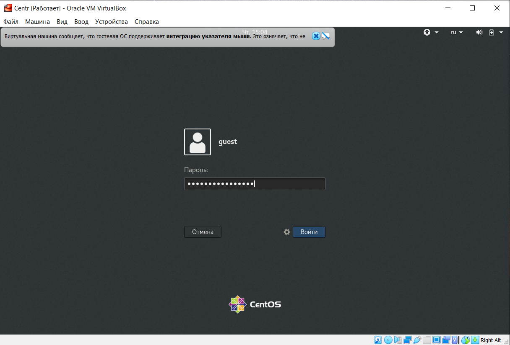{ #fig:005 }

4. Определите директорию, в которой вы находитесь, командой pwd. Сравните её с приглашением командной строки. Определите, является ли она вашей домашней директорией? Если нет, зайдите в домашнюю директорию.([рис. 4](pic/4.png))
#####Данная строка является домашней директорией данного пользователя

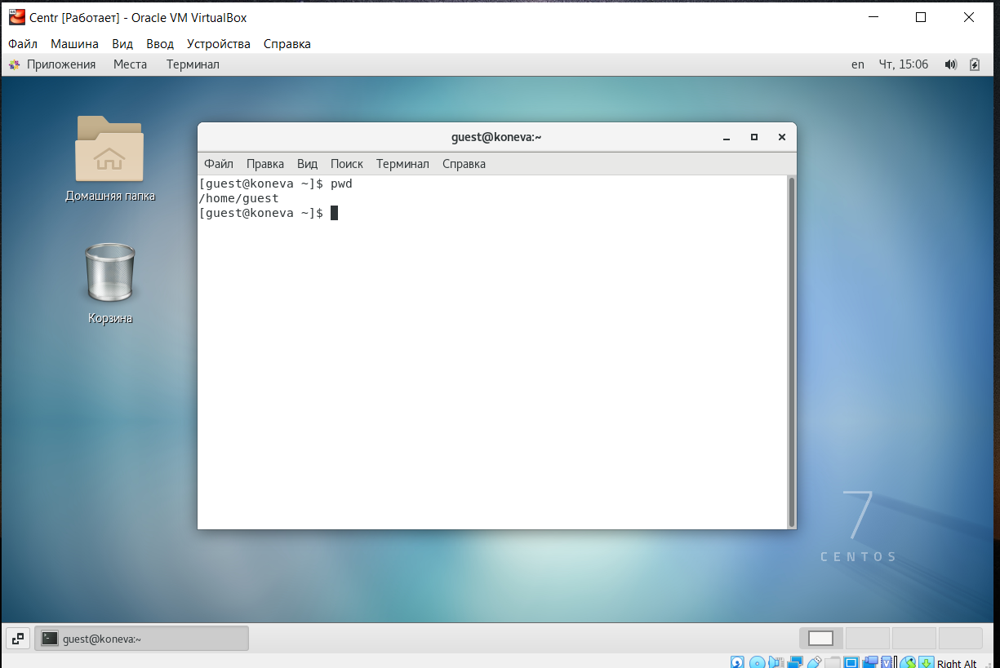{ #fig:006 }

5. Уточните имя вашего пользователя командой whoami ([рис. 5](pic/5.png))

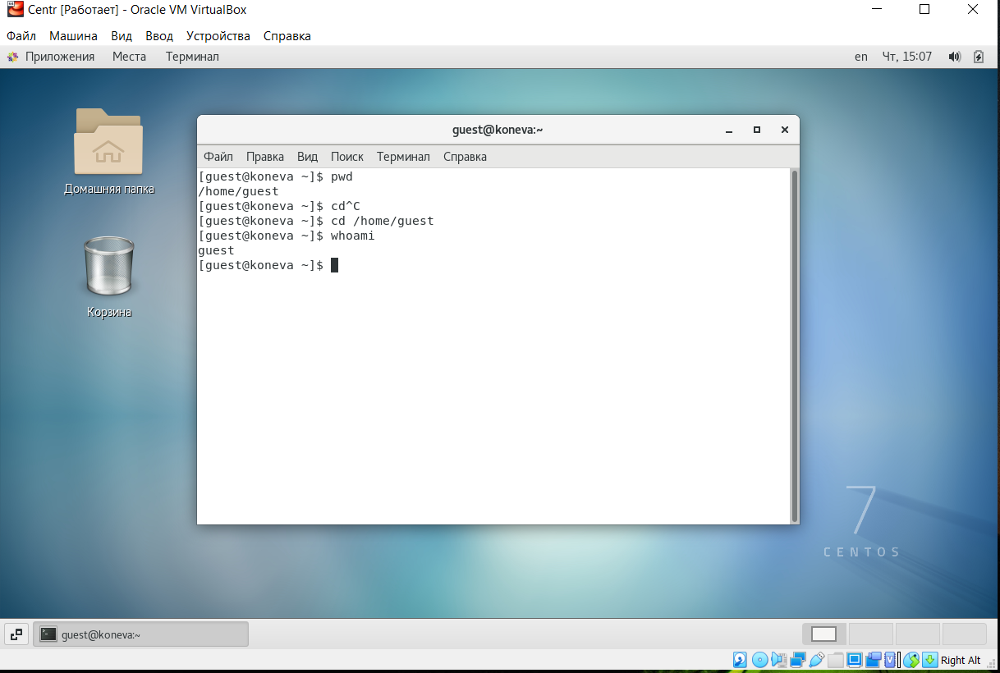{ #fig:007 }

6. Уточните имя вашего пользователя, его группу, а также группы, куда входит пользователь, командой id. Выведенные значения uid, gid и др. запомните. Сравните вывод id с выводом команды groups. ([рис. 6](pic/6.png))

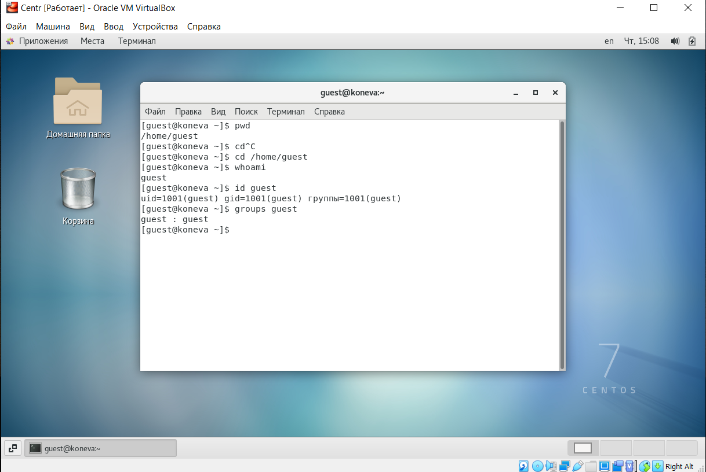{ #fig:008 }

7. Сравните полученную информацию об имени пользователя с данными, выводимыми в приглашении командной строки ([рис. 7](pic/7.png))

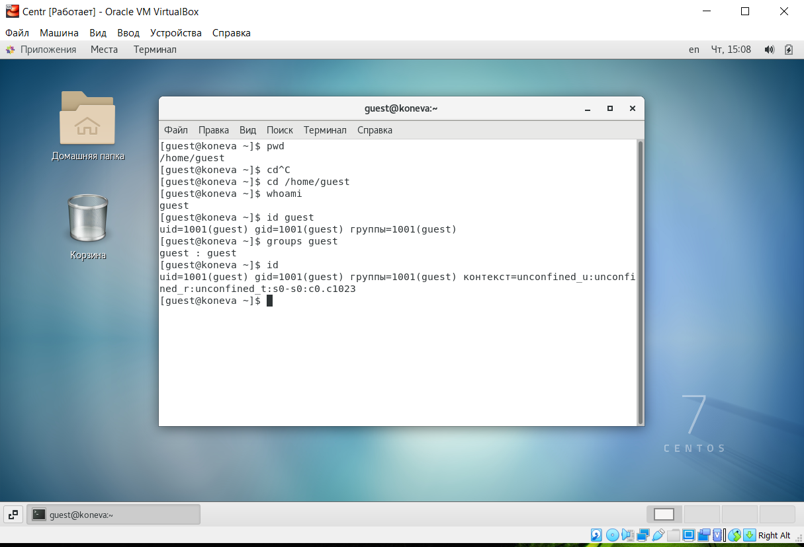{ #fig:009 }

8. Просмотрите файл /etc/passwd командой cat /etc/passwd ([рис. 8](pic/8.png))

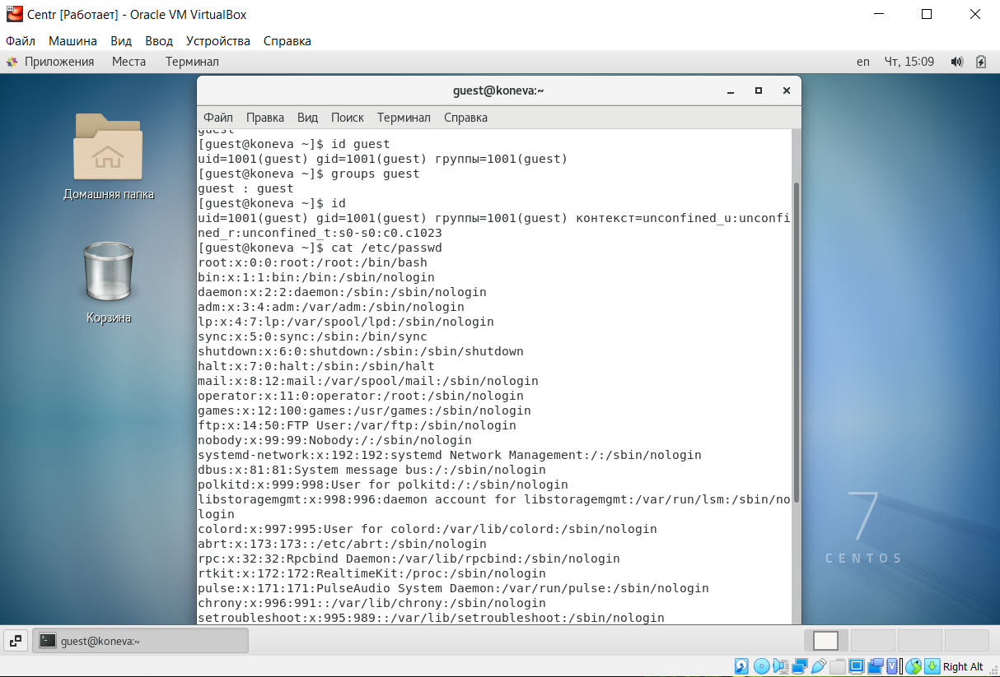{ #fig:010 }

#####Замечание: в случае, когда вывод команды не умещается на одном экране монитора, используйте прокрутку вверх–вниз (удерживая клавишу shift, нажимайте page up и page down) либо программу grep в качестве фильтра для вывода только строк, содержащих определённые буквенные сочетания: cat /etc/passwd | grep guest

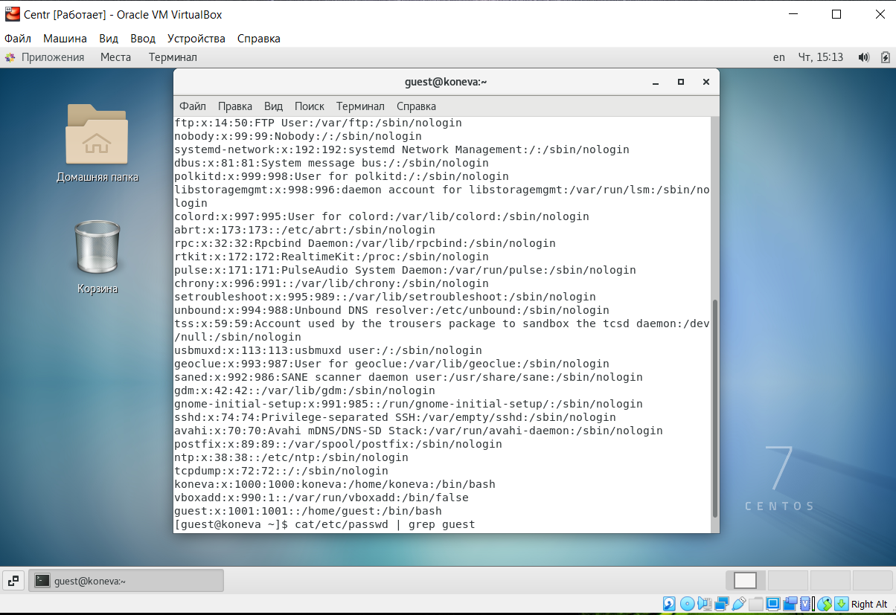{ #fig:011 }
Сравнила данные, получив в некоторых пунктах одинаковые данные

9. Определите существующие в системе директории командой ls -l /home/. Удалось ли вам получить список поддиректорий директории /home? Какие права установлены на директориях? ([рис. 10](pic/10.png))

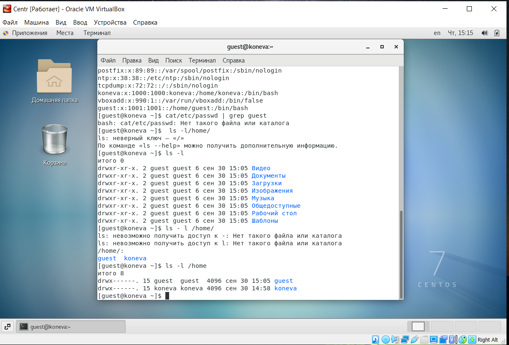{ #fig:011 }
Все директории, которые находятся в home, доступны для владельца.

10. Проверьте, какие расширенные атрибуты установлены на поддиректориях, находящихся в директории /home, командой: lsattr /home. Удалось ли вам увидеть расширенные атрибуты директории? Удалось ли вам увидеть расширенные атрибуты директорий других пользователей? ([рис. 11](pic/11.png))

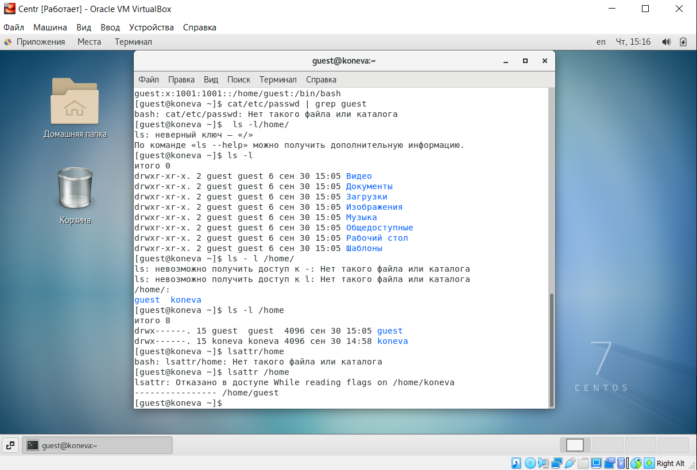{ #fig:012 }

К сожалению, доступ ограничен для других пользователей.

11. Создайте в домашней директории поддиректорию dir1 командой mkdir dir1 Определите командами ls -l и lsattr, какие права доступа и расширенные атрибуты были выставлены на директорию dir1. ([рис. 12](pic/12.png))

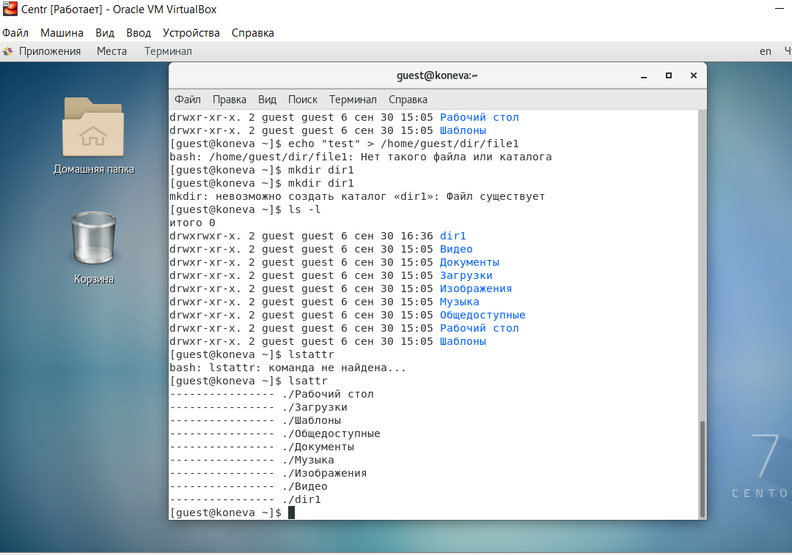{ #fig:013 }

12. Снимите с директории dir1 все атрибуты командой chmod 000 dir1 и проверьте с её помощью правильность выполнения команды ls -l ([рис. 13](pic/13.png))

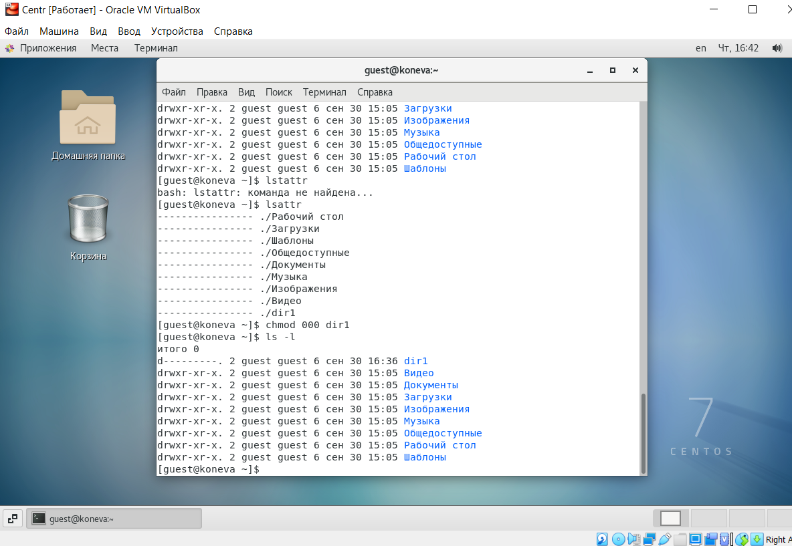{ #fig:014 }

13. Попытайтесь создать в директории dir1 файл file1 командой echo "test" > /home/guest/dir1/file1 Объясните, почему вы получили отказ в выполнении операции по созданию файла? Оцените, как сообщение об ошибке отразилось на создании файла? Проверьте командой ls -l /home/guest/dir1 действительно ли файл file1 не находится внутри директории dir1.([рис. 14](pic/13.png))

{ #fig:015 }

14. Заполнил таблицу «Установленные права и разрешённые действия» табл [-@tbl:avoid]

| | | | | | | | | | |
|-|-|-|-|-|-|-|-|-|-|
|Права директории|Права файла|Создание фаайла|Удаление файла|Запись в файле|Чтение файла|Смена директории|Просмотр файлов в директории|Переименование файла|Смена атрибутов файла|
| | | | | | | | | | |
|d--------(000)|0|-|-|-|-|-|-|-|-|
| | | | | | | | | | |
|d--x-----(100)|0|-|-|-|-|+|-|-|+|
| | | | | | | | | | |
|d-w------(200)|0|-|-|-|-|-|-|-|-|
| | | | | | | | | | |
|d----wx--(300)|0|+|+|-|-|+|-|+|+|
| | | | | | | | | | |
|dr-------(400)|0|-|-|-|-|-|+|-|-|
| | | | | | | | | | |
|dr-x-----(500)|0|-|-|-|-|+|+|-|+|
| | | | | | | | | | |
|drw------(600)|0|-|-|-|-|-|+|-|-|
| | | | | | | | | | |
|drwx-----(700)|0|+|+|-|-|+|+|+|+|
| | | | | | | | | | |
|d--------(000)|--x------- (100)|-|-|-|-|-|-|-|-|
| | | | | | | | | | |
|d--x-----(100)|--x------- (100)|-|-|-|-|+|-|-|+|
| | | | | | | | | | |
|d-w------(200)|--x------- (100)|-|-|-|-|-|-|-|-|
| | | | | | | | | | |
|d----wx--(300)|--x------- (100)|+|+|-|-|+|-|+|+|
| | | | | | | | | | |
|dr-------(400)|--x------- (100)|-|-|-|-|-|+|-|-|
| | | | | | | | | | |
|dr-x-----(500)|--x------- (100)|-|-|-|-|+|+|-|+|
| | | | | | | | | | |
|drw------(600)|--x------- (100)|-|-|-|-|-|+|-|-|
| | | | | | | | | | |
|drwx-----(700)|--x------- (100)|+|+|-|-|+|+|+|+|
| | | | | | | | | | |
|d--------(000)|-w--------(200)|-|-|-|-|-|-|-|-|
| | | | | | | | | | |
|d--x-----(100)|-w--------(200)|-|-|+|-|+|-|-|+|
| | | | | | | | | | |
|d-w------(200)|-w--------(200)|-|-|-|-|-|-|-|-|
| | | | | | | | | | |
|d----wx--(030)|-w--------(200)|+|+|+|-|+|-|+|+|
| | | | | | | | | | |
|d---r----(040)|-w--------(200)|-|-|-|-|-|+|-|-|
| | | | | | | | | | |
|d---r-x--(050)|-w--------(200)|-|-|+|-|+|+|-|+|
| | | | | | | | | | |
|d---rw---(060)|-w--------(200)|-|-|-|-|-|+|-|-|
| | | | | | | | | | |
|d---rwx--(070)|-w--------(200)|+|+|+|-|+|+|+|+|
| | | | | | | | | | |
|d--------(000)|-wx-------(300)|-|-|-|-|-|-|-|-|
| | | | | | | | | | |
|d--x-----(100)|-wx-------(300)|-|-|+|-|+|-|-|+|
| | | | | | | | | | |
|d-w------(200)|-wx-------(300)|-|-|-|-| |-|-|-|
| | | | | | | | | | |
|d----wx--(300)|-wx-------(300)|+|+|+|-|+|-|+|+|
| | | | | | | | | | |
|dr-------(400)|-wx-------(300)|-|-|-|-|-|+|-|-|
| | | | | | | | | | |
|dr-x-----(500)|-wx-------(300)|-|-|+|-|+|+|-|+|
| | | | | | | | | | |
|drw------(600)|-wx-------(300)|-|-|-|-|-|+|-|-|
| | | | | | | | | | |
|drwx-----(700)|-wx-------(300)|+|+|+|-|+|+|+|+|
| | | | | | | | | | |
|d--------(000)|r--------- (400)|-|-|-|-|-|-|-|-|
| | | | | | | | | | |
|d--x-----(100)|r--------- (400)|-|-|-|+|+|-|-|+|
| | | | | | | | | | |
|d-w------(200)|r--------- (400)|-|-|-|-|-|-|-|-|
| | | | | | | | | | |
|d----wx--(300)|r--------- (400)|+|+|-|+|+|-|+|+|
| | | | | | | | | | |
|dr-------(400)|r--------- (400)|-|-|-|-|-|+|-|-|
| | | | | | | | | | |
|dr-x-----(500)|r--------- (400)|-|-|-|+|+|+|-|+|
| | | | | | | | | | |
|drw------(600)|r--------- (400)|-|-|-|-|-|+|-|-|
| | | | | | | | | | |
|drwx-----(700)|r--------- (400)|+|+|-|+|+|+|+|+|
| | | | | | | | | | |
|d--------(000)|r-x-------(500)|-|-|-|-|-|-|-|-|
| | | | | | | | | | |
|d--x-----(100)|r-x-------(500)|-|-|-|+|+|-|-|+|
| | | | | | | | | | |
|d-w------(200)|r-x-------(500)|-|-|-|-|-|-|-|-|
| | | | | | | | | | |
|d----wx--(300)|r-x-------(500)|+|+|-|+|+|-|+|+|
| | | | | | | | | | |
|dr-------(400)|r-x-------(500)|-|-|-|-|-|+|-|-|
| | | | | | | | | | |
|dr-x-----(500)|r-x-------(500)|-|-|-|+|+|+|-|+|
| | | | | | | | | | |
|drw------(600)|r-x-------(500)|-|-|-|-|-|+|-|-|
| | | | | | | | | | |
|drwx-----(700)|r-x-------(500)|+|+|-|+|+|+|+|+|
| | | | | | | | | | |
|d--------(000)|rw-------- (600)|-|-|-|-|-|-|-|-|
| | | | | | | | | | |
|d--x-----(100)|rw-------- (600)|-|-|+|+|+|-|-|+|
| | | | | | | | | | |
|d-w------(200)|rw-------- (600)|-|-|-|-|-|-|-|-|
| | | | | | | | | | |
|d----wx--(300)|rw-------- (600)|+|+|+|+|+|-|+|+|
| | | | | | | | | | |
|dr-------(400)|rw-------- (600)|-|-|-|-|-|+|-|-|
| | | | | | | | | | |
|dr-x-----(500)|rw-------- (600)|-|-|+|+|+|+|-|+|
| | | | | | | | | | |
|drw------(600)|rw-------- (600)|-|-|-|-|-|+|-|-|
| | | | | | | | | | |
|drwx-----(700)|rw-------- (600)|+|+|+|+|+|+|+|+|
| | | | | | | | | | |
|d--------(000)|rwx------- (700)|-|-|-|-|-|-|-|-|
| | | | | | | | | | |
|d--x-----(100)|rwx------- (700)|-|-|+|+|+|-|-|+|
| | | | | | | | | | |
|d-w------(200)|rwx------- (700)|-|-|-|-|-|-|-|-|
| | | | | | | | | | |
|d----wx--(300)|rwx------- (700)|+|+|+|+|+|-|+|+|
| | | | | | | | | | |
|dr-------(400)|rwx------- (700)|-|-|-|-|-|+|-|-|
| | | | | | | | | | |
|dr-x-----(500)|rwx------- (700)|-|-|+|+|+|+|-|+|
| | | | | | | | | | |
|drw------(600)|rwx------- (700)|-|-|-|-|-|+|-|-|
| | | | | | | | | | |
|drwx-----(700)|rwx------- (700)|+|+|+|+|+|+|+|+|

15.Минимально необходимые права для выполнения операций {#tbl:min}

| | | |
|-|-|-|
|Операция|Минимальные права на директорию|Минимальные права на файл|
|Создание файла.|d-wx------ (300)|0|
|Удаление файла|d-wx------ (300)|0|
|Чтение файла|d--x------ (100)|r---------(400)|
|Запись в файл|d--x------ (100)|-w--------(200)|
|Переименование файла|d-wx------ (300)|0|
|Создание поддиректории|d-wx------ (300)|0|
|Удаление поддиректории|d-wx------ (300)|0|

# Вывод

Выполняя данную лабораторную работу, я получил практические навыкои работы в консоли с атрибутами файлов, закрепил теоретические основы дискреционного разграничения доступа в современных системах с открытым кодом на базе ОС Linux.

# Список литературы

1.	CentOS [Электронный ресурс]. Википедия.Свободная энциклопедия., 2021. URL: <https://ru.wikipedia.org/wiki/CentOS>.
